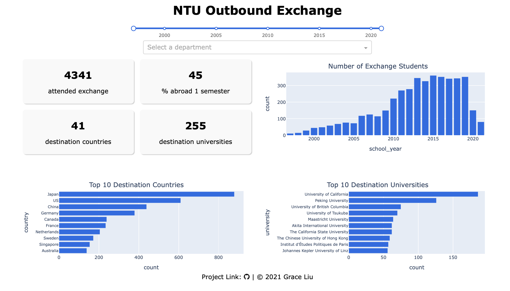

# NTU Excahnge Analysis
[](http://ec2-13-52-247-219.us-west-1.compute.amazonaws.com:8888)

This is a [Dash](https://plotly.com/dash/) app visualizing the statisitcs of outbound exchange program at [National Taiwan University (NTU)](https://www.ntu.edu.tw/index.html).

The app answers questions like which countries students go to exchange, which universities students attended exchange, and how many students participated in exchange each year. The app allows users to select time range and department that they are interested in.

## Access the app
Click [here](http://ec2-13-52-247-219.us-west-1.compute.amazonaws.com:8888) to view the app. Note that this is the English version. Click [here](https://ntu-exchange-analysis.herokuapp.com) for the Mandarin version.

## Technologies
- [Dash](https://plotly.com/dash/) - Main server and interactive components
- [Plotly Python](https://plot.ly/python/) - Used to create the interactive plots
- [Heroku](https://heroku.com) - Cloud server for app deployment

## Data
- Main dataset is from [Office of International Affairs, NTU](https://oia.ntu.edu.tw/students/outgoing.students.experience.do/).
- Department names Mandarin to English: https://www.aca.ntu.edu.tw/curri/curs_deptabb.asp
- Country names Mandarin to English: https://www.mofa.gov.tw/News_Content.aspx?n=491&s=85015
- University names Mandarin to English: https://oia.ntu.edu.tw/outgoing/school.list (click "申請資料" to view the English name for each school)

## Running the app

First create a virtual environment with conda or venv inside a temp folder, then activate it.

```
virtualenv venv

# Windows
venv\Scripts\activate
# Or Linux
source venv/bin/activate

```

Clone the git repo, then install the requirements with pip.

```

git clone https://github.com/grceliu/ntu-exchange-analysis-eng.git
cd ntu-exchange-analysis-eng
pip install -r requirements.txt

```

Run the app.

```

python app.py

```
